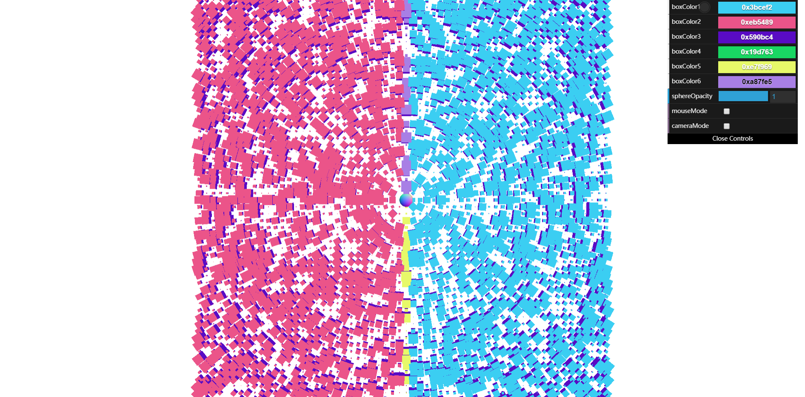
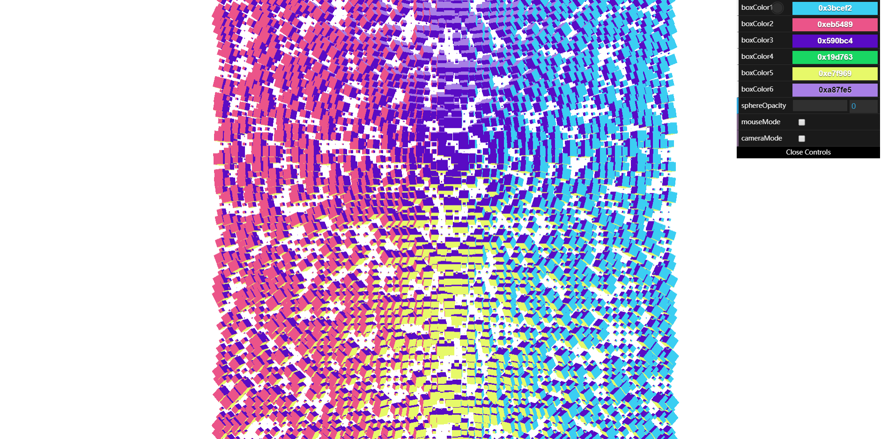
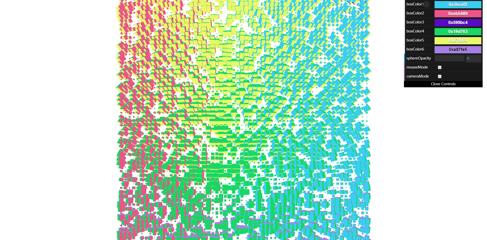
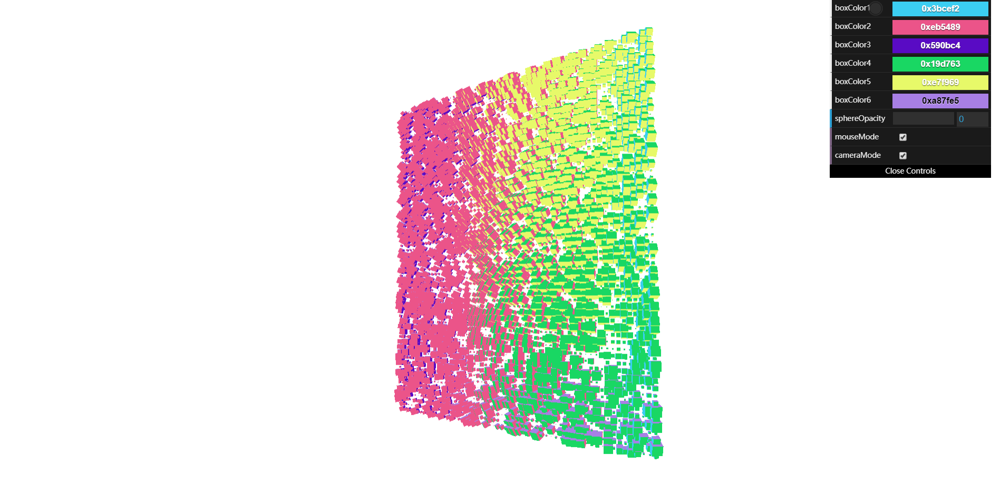

**Color Wall**
========
### Yang Shen B161006079 ###

#### Catalog ####
Color Wall
* audio (sound sourse)
  * BackwardCymbalCrashwithEcho.mp3
  * BongoAccent.mp3
  * CongaTap.mp3
  * SingleRubofWashboard.mp3
* build
  * three.min.js
* css
  * style.css
* images (final screen composition)
  * 1.png
  * 2.png
  * 3.png
  * 4.png
* js
  * dat.gui.min.js
  * index.js
  * OrbitControls.js
* index.html
* README.md

#### Links ####
[DAT505-Code Github](https://github.com/LavaSheny/DAT505-Code/tree/master/YangShen-DAT505-Assignment/Color%20Wall)

#### final screen composition ####








#### An audiovisual interactive composition ####
This final project applies to the `cube array`, `color GUI` and `look at` knowledge in the first three weeks of classroom cases. I also have tried to explore the music visualization but it is not easy to implement in my code. Because my scene contains a lot of cubes with different colors on different faces that although cubes' rotations can be colorful, it can easily collapse when combined with sound frequencies. Thus, I changed my train of thought to let the interaction between people and cubes emit sounds instead of music driving the change of cubes, which is just the opposite of previous ideas.

Fortunately, I finally made this interactive composition and named it `color wall`. This wall is made up of many cubes and can change color with the position of the sphere or your mouse. The reason I chose to use cube as a wall component is that cube has six faces, If we can define different colors for each face, cube will have a colorful effect when it rotated, so that the wall can be discolored. In addition, the reason why different sizes of cube are arranged in plane is that the same size of cube appears too crowded and airtight when arranged. As long as the cubes are arranged in different sizes within a limited range of cube sizes, they can still form a wall-like plane. I set up several GUIs to control variables in the scene to increase interactivity.

#### Description ####
Theres is a cube array which includes 61*61 random-sized cubes in both horizontal and vertical directions form a color wall. A sphere (which can also be manually controlled) moves back and forth in the cube group along the set path. Every cube looks at the moving sphere and rotates to follow sphere's position. Each of these cubes has different colors on each face, so the color wall has a colorful effect when cubes rotated. I have set up GUI to control some variables. First, the color of each face of cube can be defined separately. Second, the transparency of the sphere can be controlled. When the sphere is transparent, the color wall looks like it's changing colors automatically. What is more, `mouseMode` and `cameraMode` functions allow you to control the position of sphere and camera manually or automatically. The code plays different sounds depending on the location of the sphere. It's a way of realizing interation between people and virtual scene.

#### Usage ####
```html
<script src="build/three.min.js"></script>
<script src="js/dat.gui.min.js"></script>
<script src="js/OrbitControls.js"></script>
```

* The code creates a scene, a camera, a light, defines window size, camera position and the properties of mouse. It also creates container as element `div`,  a `WebGL` renderer for the scene and camera, and it adds that viewport to the document.body container.

```javascript
var camera, scene, renderer;
var mouseX = 0, mouseY = 0;
var container;
var windowHalfX = window.innerWidth / 2;
var windowHalfY = window.innerHeight / 2;

init();
animate();

function init() {
	   container = document.createElement( 'div' );
	   document.body.appendChild( container );

	   scene = new THREE.Scene();
	   scene.background = new THREE.Color( 0xffffff );

	   camera = new THREE.PerspectiveCamera( 40, window.innerWidth / window.innerHeight, 1, 10000 );
	   camera.position.set( 0, 0, 400 );
     scene.add( camera );

	   scene.add( new THREE.AmbientLight( 0xffffff, 0.2 ) );
 var light = new THREE.PointLight( 0xffffff, 1 );
	   camera.add( light );

     renderer = new THREE.WebGLRenderer();
     renderer.setPixelRatio( window.devicePixelRatio );
     renderer.setSize( window.innerWidth, window.innerHeight );
     container.appendChild( renderer.domElement );

     document.addEventListener( 'mousemove', onDocumentMouseMove, false );
     window.addEventListener( 'resize', onWindowResize, false );
   }
```

* Create sphere to drive cubes to rotate and create geometry to create cube array to add in mesh. Sphere's material has been set to adjustable transparency so that sphere can be hidden. Define 6 random colors and substitute them into the material array to store them for giving values to independent cube face color. Create a two dimensional grid of meshs, and position them accordingly. Value starts from -150 and sequentially add one every 5 pixels. Define random size of mesh that each cube can have different size.

```javascript
var color1,color2,color3,color4,color5,color6;
var sphere = new THREE.Mesh( new THREE.SphereGeometry( 5, 10, 10 ), new THREE.MeshNormalMaterial({transparent: true}) );       
var geometry = new THREE.BoxGeometry( 15, 15, 15 );
    geometry.rotateX( Math.PI / 2 );

    color1 = Math.random()*0xffffff;
    color2 = Math.random()*0xffffff;
    color3 = Math.random()*0xffffff;
    color4 = Math.random()*0xffffff;
    color5 = Math.random()*0xffffff;
    color6 = Math.random()*0xffffff;

var material = [];
    material[0] = new THREE.MeshBasicMaterial({ color: color1});
    material[1] = new THREE.MeshBasicMaterial({ color: color2});
    material[2] = new THREE.MeshBasicMaterial({ color: color3});
    material[3] = new THREE.MeshBasicMaterial({ color: color4});
    material[4] = new THREE.MeshBasicMaterial({ color: color5});
    material[5] = new THREE.MeshBasicMaterial({ color: color6});

for (var x = -150; x < 150; x += 5) {
for (var y = -150; y < 150; y += 5) {
var mesh = new THREE.Mesh( geometry, material );
var sizeRand = Math.random() * 0.5;
    mesh.scale.set(sizeRand,sizeRand,sizeRand);
    mesh.position.x = x;
    mesh.position.y = y;
    mesh.position.z = 0;
    scene.add( mesh );
 }
}
```

* Define initial values of controller to control gui. Create gui and set options in gui folder. Define control range of each option. Set `boxColor` and `sphereOpacity` options in gui folder to control the color of each cube surface and sphere's transparency. Set `mouseMode` to switch sphere movement automatically or manually and set `cameraMode` to switch manual control or fix camera position.

```javascript
var controller = new function(){
    this.boxColor1 = color1;
    this.boxColor2 = color2;
    this.boxColor3 = color3;
    this.boxColor4 = color4;
    this.boxColor5 = color5;
    this.boxColor6 = color6;
    this.sphereOpacity = 1;
		this.mouseMode = false;
		this.cameraMode = false;
}

var gui = new dat.GUI();
    gui.addColor( controller, 'boxColor1', color1 ).onChange( function() {
    mesh.material[0].color.setHex(controller.boxColor1);
    });
    gui.addColor( controller, 'boxColor2', color2 ).onChange( function() {
    mesh.material[1].color.setHex(controller.boxColor2);
    });
    gui.addColor( controller, 'boxColor3', color3 ).onChange( function() {
    mesh.material[2].color.setHex(controller.boxColor3);
    });
    gui.addColor( controller, 'boxColor4', color4 ).onChange( function() {
    mesh.material[3].color.setHex(controller.boxColor4);
    });
    gui.addColor( controller, 'boxColor5', color5 ).onChange( function() {
    mesh.material[4].color.setHex(controller.boxColor5);
    });
    gui.addColor( controller, 'boxColor6', color6 ).onChange( function() {
    mesh.material[5].color.setHex(controller.boxColor6);
    });
    gui.add( controller, 'sphereOpacity', 0, 1 ).onChange( function() {
    sphere.material.opacity = (controller.sphereOpacity);
    });
		gui.add( controller, 'mouseMode', false, true ).onChange( function() {
		if(controller.mouseMode){
			mouseMode = 1;
		}
		else{
			mouseMode = 2;
		}
		});
		gui.add( controller, 'cameraMode', false, true ).onChange( function() {
		if(controller.cameraMode){
			cameraMode = 1;
		}
		else{
			cameraMode = 2;
		}
		});
```

* The code below is used to define the colors of different possibility that gui can control the meshs' color.

```javascript
function dec2hex(i) {
  var result = "0x000000";
  if (i >= 0 && i <= 15) { result = "0x00000" + i.toString(16); }
  else if (i >= 16 && i <= 255) { result = "0x0000" + i.toString(16); }
  else if (i >= 256 && i <= 4095) { result = "0x000" + i.toString(16); }
  else if (i >= 4096 && i <= 65535) { result = "0x00" + i.toString(16); }
  else if (i >= 65535 && i <= 1048575) { result = "0x0" + i.toString(16); }
  else if (i >= 1048575 ) { result = '0x' + i.toString(16); }
  if (result.length == 8){return result;}
}
```

* Define 2 controlIDs and set up 2 options. `mouseMode` option 1: let sphere move automatically over time; option 2: let mouse control the movement of sphere. `cameraMode` option 1: let camera follows the mouse and keeps looking at the postion of the scene; option 2: reset the postion of camera and let camera keep looking at the postion of the scene.

```javascript
var controlID = 2;
var mouseMode,cameraMode;
var time = Date.now() * 0.002;

if(mouseMode == 1){
	sphere.position.x = Math.sin( time * 0.3 ) * 100;
	sphere.position.y = Math.cos( time * 0.3 ) * 100;
	sphere.position.z = Math.cos( time * 0.3 ) * 100;
}
else{
	sphere.position.x =  mouseX;
	sphere.position.y = -mouseY;
	sphere.position.z = -mouseY;
}
if(cameraMode == 1){
	camera.position.x += ( mouseX - camera.position.x ) * .05;
	camera.position.y += ( - mouseY - camera.position.y ) * .05;
	camera.lookAt( scene.position );
	}
else{
	camera.position.set( 0, 0, 400 );
	camera.lookAt( scene.position );
}
```

* Let each cube be the value of the scene array and let them look at the moving sphere independently.

```javascript
for ( var i = 1, l = scene.children.length; i < l; i ++ ) {
				scene.children[ i ].lookAt( sphere.position );
		}
```

*  Create an AudioListener and add it to the camera. Create a global audio source. Load a sound and set it as the Audio object's buffer. Set up various situation to load and play different sounds.

```javascript
var listener = new THREE.AudioListener();
var listener1 = new THREE.AudioListener();
var listener2 = new THREE.AudioListener();

var sound = new THREE.Audio( listener );
var sound1 = new THREE.Audio( listener1 );
var sound2 = new THREE.Audio( listener1 );

var audioLoader = new THREE.AudioLoader();
var audioLoader1 = new THREE.AudioLoader();
var audioLoader2 = new THREE.AudioLoader();

if ( sphere.position.z > 30 ) {
    audioLoader.load( 'audio/BongoAccent.mp3', function( buffer ) {
    sound.setBuffer( buffer );
    sound.setLoop( false );
    sound.setVolume( 0.5 );
    sound.play();
    });
    } else if ( sphere.position.z < -30 ){audioLoader1.load( 'audio/SingleRubofWashboard.mp3', function( buffer ) {
    sound1.setBuffer( buffer );
    sound1.setLoop( false );
    sound1.setVolume( 0.5 );
    sound1.play();
    });
    } else{audioLoader2.load( 'audio/CongaTap.mp3', function( buffer ) {
    sound2.setBuffer( buffer );
    sound2.setLoop( false );
    sound2.setVolume( 2 );
    sound2.play();
    });
    }
```

* Define screen size and implement mouse movement events.

```javascript
function onWindowResize() {
  windowHalfX = window.innerWidth / 2;
  windowHalfY = window.innerHeight / 2;
  camera.aspect = window.innerWidth / window.innerHeight;
  renderer.setSize( window.innerWidth, window.innerHeight );
}

function onDocumentMouseMove( event ) {
	mouseX = event.clientX - windowHalfX;
  mouseY = event.clientY - windowHalfY;
}
```
